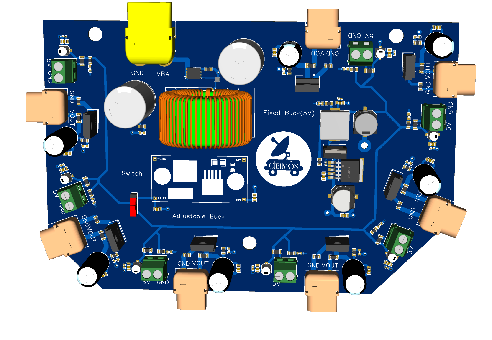

Robust 24V/5V Power Distribution Board
A compact, 4-layer Power Distribution Board (PDB) designed for robust and reliable power management. This board takes a single DC input(max voltage 36V, max current 100A) and provides multiple fused outputs at 24V and 5V, with comprehensive protection features suit.

## Features ⚡️
Dual Voltage Rails: Provides both high-power 24V and low-power 5V outputs.

Robust Input Protection:

ESD (Electrostatic Discharge) protection.

LC filter for noise reduction.

MOSFET-based reverse polarity protection.

Large bulk capacitance for input stability.

Individually Fused Outputs: Each output channel is protected by its own fuse, preventing a single fault from taking down the entire system.

High-Efficiency 5V Rail: Utilizes a high-efficiency XL4015E1 buck converter capable of delivering up to 5A.

Selectable Variable Voltage: Two 5V ports are connected to an LM2596 module, providing a switch-selectable variable voltage output for special components.

4-Layer PCB Design: Features dedicated power and ground planes for excellent electrical performance, low noise, and improved thermal management.

All important components and connectors labeled in silkscreen

## Specifications
Specification	Value	Notes
Input Voltage	~26V - 40V DC	Input must be higher than 24V
24V Outputs	7	Each fused at 30A. Pass-through from input voltage.
5V Fixed Outputs	5	Each fused at 1A.
5V Variable Outputs	2	Controlled by an LM2596 module and a selector switch.
Max Total 5V Current	5A	Limited by the XL4015E1 buck converter.
PCB Layers	4	Signal, GND, Vin (24V), 5V
Primary 5V Converter	XL4015E1	High-efficiency synchronous buck converter.
Variable Voltage Converter	LM2596 Module	Adjustable step-down voltage regulator.

## Board Layout and Connections 🔌
Layer Stack-up
The 4-layer design is critical for the board's performance:

Top Layer: Signal traces and component placement.

Layer 2: Solid Ground Plane (GND).

Layer 3: Input Voltage Plane (Vin / 24V).

Bottom Layer: 5V Power Plane.

Connectors
1. 7 Xt60 connectors for 24V outputs
2. Xt90 for battery input
3. 7 screw terminals for 5V outputs

## How to Use
Verify Fuses: Ensure the correct fuse ratings (30A for 24V, 1A for 5V) are installed in all slots you intend to use.

Connect Input Power: Connect your main DC power supply to the J1 input terminal. The reverse polarity protection will prevent damage from incorrect wiring, but it's always best to double-check.

Connect Devices:

Connect your 24V devices to the XT60 connectors. Do not exceed 30A on any single port.

Connect your standard 5V devices (e.g., microcontrollers, sensors) to the OUT_5V headers. Remember the total current for all 5V devices should not exceed 5A.

Using Variable Outputs:

To use the variable outputs, flip switch to the ON position.

Before connecting a device, use a multimeter to measure the voltage on output of the moudle

Carefully turn the potentiometer to set your desired voltage (e.g., 3.3V, 1.8V).

Once the voltage is set, you can connect your device.

## Note
If you want a higher current in 5V outputs, carefully replace xl4015 with xl4016 which provides 7A current and has the same shape and footprint

The prices listed in the BOM are approximate.

