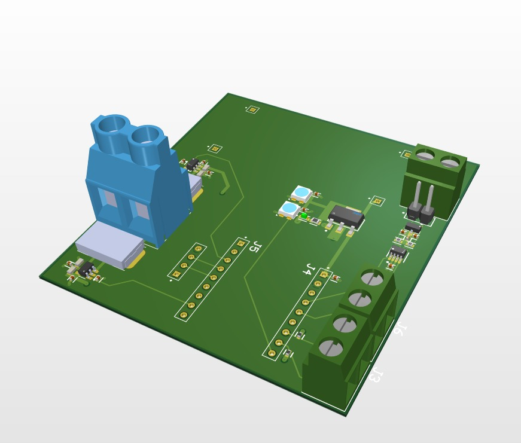

<!-- @format -->

# Technical Design Document & Reviewer's Guide

**Project**: High-Performance ESP32-S3 Motor Controller  
**Version**: 1.0  
**Date**: September 15, 2025  
**Designer**: Team Deimos

---

## 1. Overview

This document provides a detailed technical overview of the custom PCB designed for the control and monitoring of a brushed DC motor. The board is intended for robotics and automation applications where performance, real-time feedback, and network integration are critical.

The design philosophy emphasizes robustness, efficiency, and modularity. This README serves as a guide for technical review, detailing the function of each subsystem and the engineering rationale behind key component selections and circuit designs.

---

## 2. System Architecture

The board is architected around a central ESP32-S3 microcontroller. A two-stage power delivery network provides clean, stable power to all components. The system integrates high-current motor driving, precision current sensing, high-resolution encoder feedback, and CAN bus communication.

### 3D PCB Render

A 3D render of the custom PCB, showing key connectors and component placements:

---

## 3. Subsystem Deep Dive & Design Rationale

This section details the function and component choices for each block of the schematic.

### 3.1. Power Delivery Network (PDN)

A two-stage hybrid power regulation strategy was chosen for optimal efficiency and noise performance.

#### Stage 1: Buck Converter (12V → 5V)

- **Function:** Handles the large initial voltage drop from the main 12V input. This stage powers the 5V rail required by the motor encoder.
- **Component Rationale:** A buck converter (e.g., based on the LM2596) is used here for its high efficiency (>85%). Using an LDO for this large voltage step would be thermally unmanageable and waste significant power.

#### Stage 2: LDO (5V → 3.3V)

- **Function:** Provides a final, clean, and stable 3.3V rail for all sensitive logic components, including the ESP32, CAN transceiver, and current sense amplifiers.
- **Component Rationale (AZ1117CH-3.3TRG1):**
  - **Low Noise:** The LDO acts as a filter, removing the switching noise (ripple) from the preceding buck stage, which is critical for the accuracy of the ADC readings.
  - **High Current & Thermal Headroom:** The AZ1117CH is rated for 1A and comes in a SOT-223 package. This provides a substantial safety margin over the ESP32's peak current draw (~500mA) and its package is designed to effectively dissipate the heat generated (~0.8W) into a PCB copper pour.

### 3.2. Microcontroller (MCU)

- **Component:** Waveshare ESP32-S3-Zero
- **Rationale:** This module was selected for its powerful dual-core processor and rich set of integrated peripherals, which are leveraged as follows:
  - **LEDC Peripheral:** Used for generating the stable, hardware-based PWM signal for motor speed control.
  - **PCNT (Pulse Counter) Peripheral:** Used for hardware quadrature decoding of the encoder signals. This offloads the CPU entirely from the high-frequency task of counting pulses.
  - **ADC Peripheral:** Used to read the analog voltage output from the current sense amplifiers.
  - **TWAI (CAN) Controller:** The native CAN controller is used for reliable network communication.

### 3.3. Encoder Interface

- **Function:** To safely read the signals from a 5V-powered NPN open-collector encoder with the 3.3V logic of the ESP32.
- **Design Rationale:** A dedicated level-shifter IC was intentionally avoided. Instead, a simple pull-up resistor network is used. Each signal line from the encoder is connected to an ESP32 GPIO pin and simultaneously pulled up to the 3.3V rail with a 4.7kΩ resistor.
  - **How it Works:** When the encoder's open-collector output is inactive (high-impedance), the resistor pulls the GPIO pin up to a safe 3.3V. When the encoder output activates, it pulls the line down to 0V. This is a robust, low-cost, and component-efficient method for level shifting this specific type of signal.

### 3.4. Current Sensing

- **Function:** To provide real-time measurement of the current flowing to the motor. A low-side sensing topology is used.
- **Component Rationale:**
  - **Shunt Resistor (WSR32L000FEA):** A very low resistance (2mΩ) shunt is chosen to minimize power loss (I²R) in the high-current motor path.
  - **Amplifier (INA181A3IDBVR):** The INA181 is a precision current sense amplifier. The 'A3' version has a fixed gain of 100 V/V. This specific gain was chosen to map the expected motor current range to the ESP32's ADC input range.
    - **Calculation:** At a max current of 13A, the voltage across the shunt is 13A _ 0.002Ω = 26mV. Amplified by the gain of 100, the output is 26mV _ 100 = 2.6V, which fits perfectly within the ESP32's 0-3.3V ADC range.

### 3.5. Directional LED Indicators

- **Function:** Provide visual feedback of the motor's direction using a single GPIO pin.
- **Design Rationale:** This circuit uses a complementary pair of transistors (one NPN, one PNP) to drive two separate LEDs from one control signal.
  - **NPN Transistor (SS8050-G):** Wired as a standard low-side switch. It turns ON and lights its corresponding LED when the GPIO pin is HIGH.
  - **PNP Transistor (SMMBT3906WT1G):** Wired as a standard high-side switch. It turns ON and lights its corresponding LED when the GPIO pin is LOW.
  - **Benefit:** This design is highly efficient, requires no special logic ICs, and conserves precious GPIO pins.

### 3.6. Programmable Status LED

- **Component:** SK6812MINI-HS Addressable RGB LED.
- **Rationale:** This specific "smart" LED was chosen because it is 3.3V-native. It can be powered by and controlled directly from the 3.3V rail and a standard ESP32 GPIO pin without requiring the level-shifting circuitry that 5V addressable LEDs need. This simplifies the design and increases reliability. Two are chained together for expanded status indication.

---

## 4. Areas for Review

Particular attention is requested on the following aspects of the design:

- **PCB Layout:** Review of the high-current paths for the motor driver and the placement of decoupling capacitors for the power regulators and sensitive ICs.
- **Thermal Management:** Confirmation that the copper pour for the SOT-223 LDO is sufficient for heat dissipation.
- **Signal Integrity:** Review of the encoder and CAN bus trace routing to ensure they are adequately shielded from the noisy motor driver section.

---

_End of Document_
